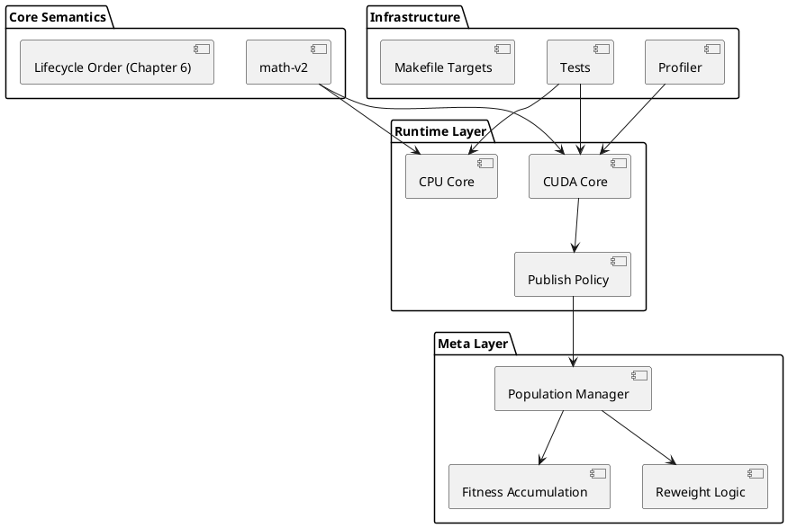
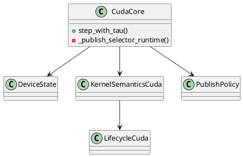
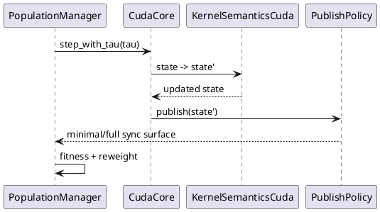
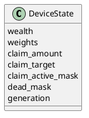
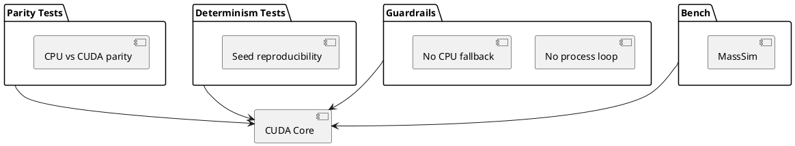

# Architecture Overview – meta-credit-dynamics (Phase H1 / H2)

Status: Phase H2 complete
Scope: CPU + CUDA Runtime, Deterministic Lifecycle, Publish Policy, Meta Layer

---

# 1. Architectural Principles

1. **Closed Semantic Domain**
   CUDA Hot Path contains no CPU fallback logic.

2. **CPU as Oracle**
   CPU implementation defines semantic ground truth.

3. **Determinism First**
   All GPU operations must preserve deterministic replay under fixed seed.

4. **Explicit Publish Contract**
   Device→Host synchronization is governed by explicit policy.

5. **Test-Gated Evolution**
   Structural refactors are protected by parity + determinism + guardrail tests.

---

# 2. High-Level Component Architecture

---

# 3. CUDA Runtime Structure

Responsibilities:

* **DeviceState**: Owns all tensor state (wealth, claims, masks, etc.)
* **KernelSemanticsCuda**: Pure tensor transformation (Chapter 6 phases)
* **LifecycleCuda**: Orchestrates semantic phase order
* **PublishPolicy**: Controls D2H synchronization surface
* **CudaCore**: Runtime wrapper coordinating state transitions

---

# 4. Lifecycle Sequence (One Tau Step)

Sequence Notes:

* Kernel executes entirely on device
* Publish layer decides sync surface
* Meta layer may influence next step

---

# 5. State Model (CUDA)

All fields are device-resident tensors.

Slot model:

* Structure-of-Arrays (SoA)
* Fixed `max_claims_per_process`
* Prefix-append insertion
* Deterministic prefix-compaction

---

# 6. Publish Policy Modes

| Mode    | Purpose       | D2H Surface   |
| ------- | ------------- | ------------- |
| minimal | Bench / Prod  | Required only |
| full    | Tests / Debug | Full mirror   |

Required surface typically includes:

* wealth
* necessary masks
* reweight inputs

Not required:

* full claim dump
* full weight vector (unless needed by meta logic)

---

# 7. Test Architecture

---

# 8. Evolution Summary

Phase H1:

* CUDA kernel path
* Deterministic state contract
* GPU validation

Phase H2:

* Scalar hygiene
* Batch core
* GPU-native claim ingestion
* Prefix-compaction
* Publish policy hardening

---

# 9. Known Constraints

* Single-GPU architecture
* Fixed slot capacity
* CPU-based meta layer (fitness + reweight)
* Determinism prioritized over maximal fusion

---

# 10. Design Philosophy

Correctness → Determinism → Structural Clarity → Performance

Never invert that order.

---

End of Architecture Document
