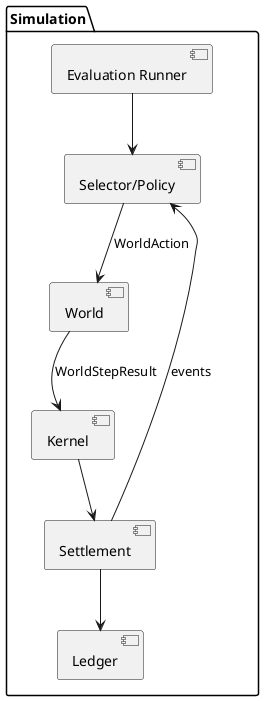

# Architecture Phase II - Closed Loop Capital Selector

Status: Target Architecture

Purpose: describe the Phase-II architecture that implements closed-loop policy coupling and the Selector-4 / Selector-5 mechanisms.

Consistency notice:

This document is an architectural view derived from `docs/v3/impl_spec_phase_ii.md`.
If wording conflicts exist, `docs/v3/impl_spec_phase_ii.md` is normative.

---

# 1. Architectural Goal

Phase II introduces a closed-loop system:

```
policy -> action -> world transition -> realized returns/costs -> wealth -> settlement -> events -> policy
```

In Phase I:

```
world -> returns -> wealth
policy -> internal state only
```

In Phase II:

```
world(action) -> realized outcome
policy(state) -> action
```

Outcome metrics are therefore policy-sensitive.

---

# 2. Core Components

Components:

* Selector / Policy
* World
* Kernel Semantics
* Settlement Engine
* Ledger
* Evaluation Runners

Responsibilities:

Selector / Policy

* computes policy action
* maintains selector statistics (`mu_term`, `rho`, `psi`)
* maintains selector-owned Phase-II state (`strategic_credit_exposure`)
* consumes derived features from Economic State (`due_curve`, `liquidity_mismatch`)

World

* consumes validated `WorldAction`
* produces action-conditioned `WorldStepResult`

Kernel

* books realized outputs from world
* does not apply a second independent exposure transform

Settlement

* processes obligations
* emits settlement/rollover/fail events
* updates economic observables (`due_curve`, `liquidity_mismatch`)
* produces deterministic `EventSummary` for selector update boundary

Runners

* `run_phase_i.py` remains the invariant reference runner
* `run_phase_ii.py` is additive for closed-loop evaluation

---

# 3. Component Diagram



---

# 4. Closed-Loop Data Flow

Normative step order:

1. selector computes and validates `WorldAction`
2. world executes `step(t, action)`
3. world returns `WorldStepResult`
4. kernel books realized return/cost
5. settlement processes obligations
6. events update Economic State observables (`due_curve`, `liquidity_mismatch`)
7. settlement/economic layer emits `EventSummary`
8. selector updates derived state (`mu_term`, `rho`, `psi`, `strategic_credit_exposure`) from `EventSummary`

---

# 5. Interface Contracts

`WorldAction` (architecture view):

```python
@dataclass
class WorldAction:
    weights: ndarray[n_channels]
    gross_exposure: float = 1.0
    leverage_limit: float = 1.0
    allow_short: bool = False
```

Normalization constraints:

```text
if allow_short == False: weights >= 0 and sum(weights) = gross_exposure
if allow_short == True:  sum(abs(weights)) = gross_exposure
gross_exposure <= leverage_limit

```

`WorldStepResult` (architecture view):

```python
@dataclass
class WorldStepResult:
    realized_return: float
    costs: float
    channel_returns: ndarray
    cost_by_channel: ndarray
    freeze: bool
```

  `EventSummary` (architecture view):

  ```python
  @dataclass
  class EventSummary:
    event_counts: dict[str, int]
    last_event: str | None
    channel_event_vector: ndarray
  ```

---

# 6. Economic Booking Rule

Normative booking:

```python
world_out = world.step(t, action)
wealth_next = wealth_prev + world_out.realized_return - world_out.costs
```

This avoids double coupling in the kernel.

---

# 7. Determinism and Parity

Determinism requirements:

* fixed seeds
* stable call order
* backend-stable event attribution

Parity classes:

* exact: terminal flags, event counts, rollover counts, timestep indices
* numerical: weights, wealth, returns, selector statistics

Starting tolerance guidance:

```text
rtol = 1e-7
atol = 1e-9
```

---

# 8. Evaluation Alignment

Phase-II evaluation is additive, not a replacement of Phase I:

```text
run_phase_i.py
run_phase_ii.py
```

Binding Phase-II hypotheses:

* H1: Selector-4 vs Selector-3 on `time_to_death`
* H2: Selector-5 vs Selector-4 on `rollover_failure_frequency`

Both are evaluated with paired bootstrap and 95% confidence intervals.

---

# 9. Compatibility with Phase I

Two guarded modes remain:

```text
Phase I: invariant engine path
Phase II: closed-loop engine path
```

Phase-I invariance tests stay in CI to prevent regression.

---

# 10. Summary

Phase II turns the selector into a causal economic actor while keeping economic observables in Economic State, exposing a deterministic `EventSummary` boundary artifact, and updating selector learning/control state from that boundary.

